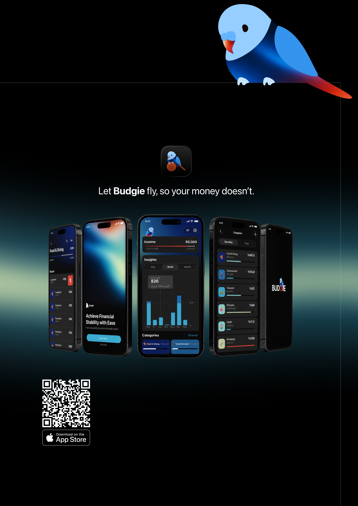
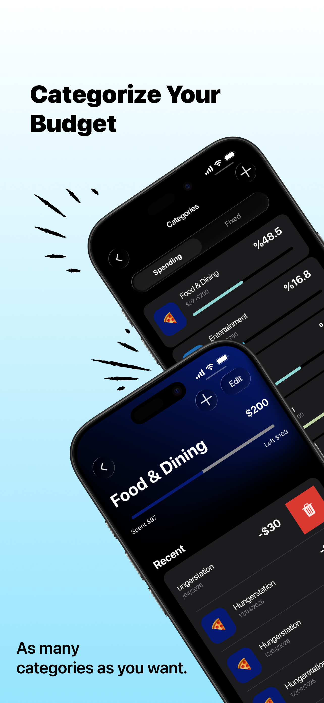
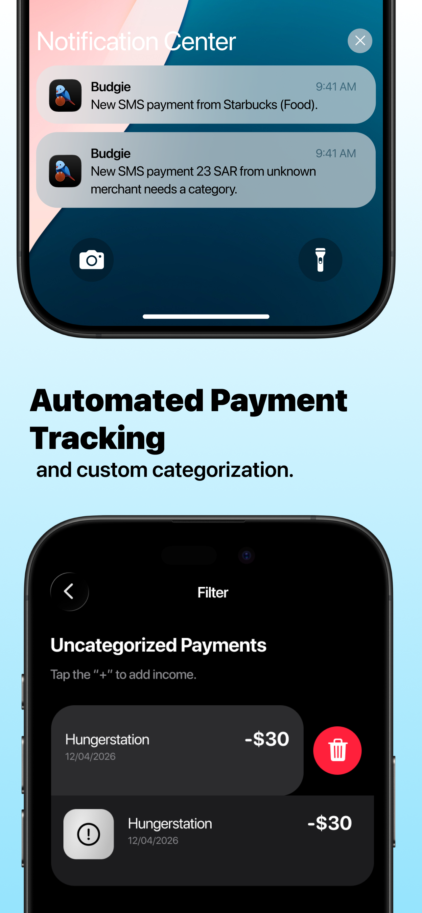
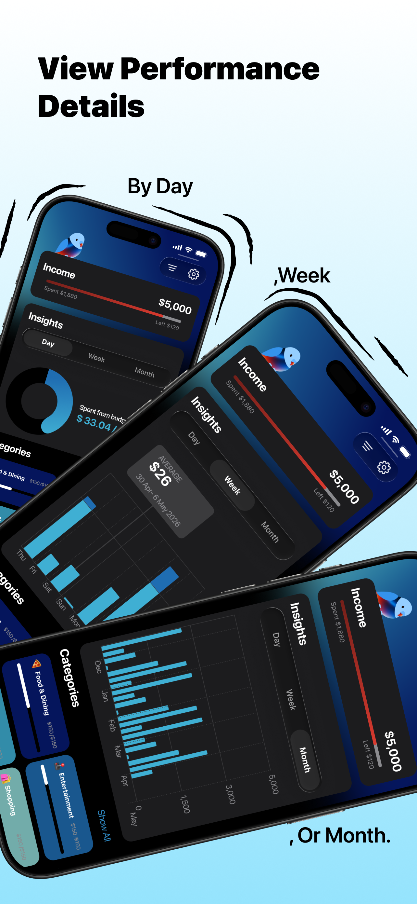
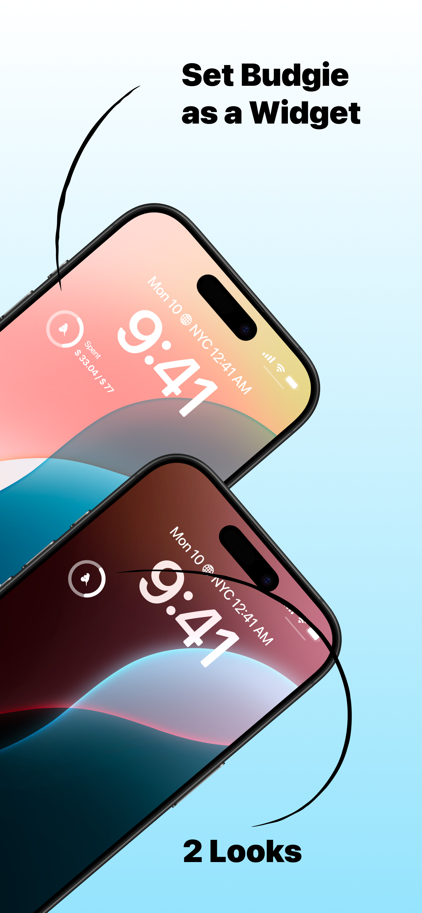

<div align="center">


# BUDGIE

### Let Budgie fly, so your money doesn’t.

A smart iOS personal finance app that makes expense tracking simpler, more automatic, and easier to understand.

[](https://apps.apple.com/sa/app/budgie-money-tracking-app/id6773916915)

</div>

<br>

<p align="center">
  
</p>

---

## About BUDGIE

BUDGIE is a personal finance and money-tracking app designed to help users understand where their money goes without the hassle of manually entering every transaction.

Using banking SMS messages through Apple Shortcuts, BUDGIE can detect spending activity, organize transactions, learn from category selections, and turn everyday expenses into clear budgets and visual insights.

The app is built around a simple idea: **financial tracking should feel effortless.**

---

## Key Features

<table>
<tr>
<td width="25%" align="center">



### Custom Categories
Organize spending into flexible categories that match the way you manage your money.

</td>

<td width="25%" align="center">



### Automatic Payment Tracking
Detect transactions from banking SMS messages and reduce the need for manual expense entry.

</td>

<td width="25%" align="center">



### Spending Insights
Explore spending patterns and performance across daily, weekly, and monthly views.

</td>

<td width="25%" align="center">



### Widgets
Keep important budget information accessible directly from your iPhone.

</td>
</tr>
</table>

---

## How BUDGIE Works

1. A banking transaction SMS is received.
2. Apple Shortcuts connects the transaction information with BUDGIE.
3. BUDGIE detects and records the transaction.
4. If the category is unclear, the user can assign one.
5. BUDGIE learns from previous category selections.
6. Transactions are transformed into organized budgets, spending history, and visual insights.

This approach allows users to track spending across multiple bank cards while keeping everything in one place.

---

## More Features

- Automatic transaction detection from banking SMS messages
- Multiple bank card support
- Custom spending categories
- Smart merchant and category learning
- Budget tracking
- Daily, weekly, and monthly analytics
- Visual spending charts
- Home and Lock Screen widgets
- Arabic and English support
- Accessibility support
- Privacy-focused experience
- No direct bank account integration required

---

## Tech Stack

BUDGIE is built as a native iOS application using Apple technologies and a modular architecture.

- **Swift**
- **SwiftUI**
- **Swift Charts**
- **WidgetKit**
- **Apple Shortcuts**
- **MVVM Architecture**
- **Local Data Persistence**
- **Accessibility APIs**
- **Notification Services**

---

## Architecture

The project follows the **MVVM — Model View ViewModel** design pattern to separate interface, business logic, and data responsibilities.

The codebase is organized into areas such as:

```text
BUDGIE
├── Models
├── Views
├── ViewModels
├── Services
├── Utilities
└── Widgets
